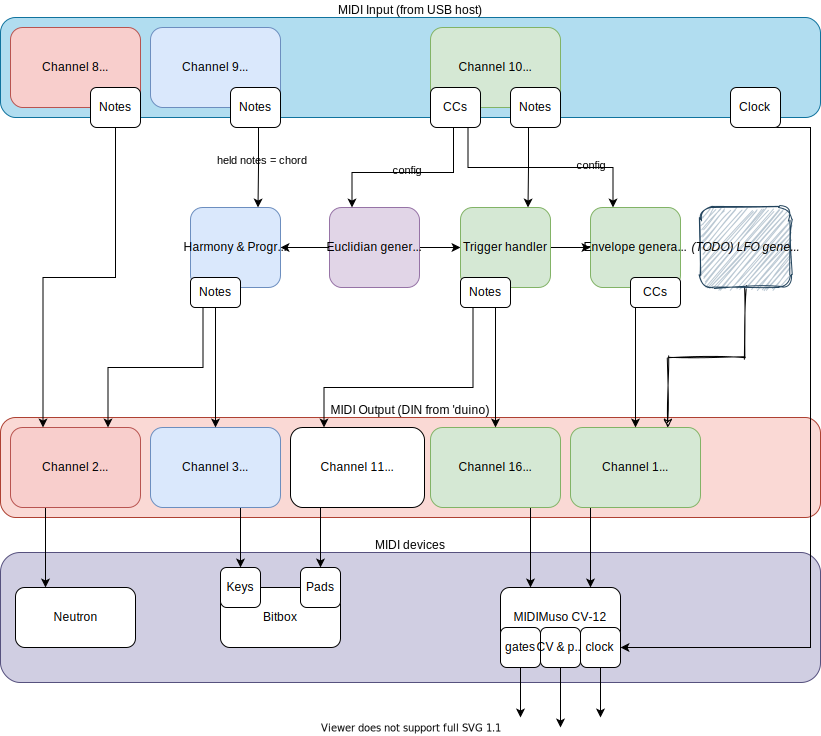

# drum2musocv

* A USB MIDI interface, originally for adapting the [MidiMuso Orac CV-12](http://midimuso.co.uk/index.php/cv-12/) to be used as a drum machine (mapping GM drum channel/notes and providing triggerable ADSR envelopes), but now with many added features.

* In active development... very likely to be bugs or things that can be very much improved.  Check back for updates or contact me if you're trying to use this!

* Currently targets [Arduino Zero clones](https://www.banggood.com/Geekcreit-SAMD21-M0-Module-32-bit-ARM-Cortex-M0-Core-Development-Board-p-1176168.html)/[Seeeduino Cortex M0+ boards](https://www.seeedstudio.com/Seeeduino-Cortex-M0-p-4070.html), originally started out on an Arduino Uno (probably possible to make it work on a Uno again or other MCUs).

* **Drum pitch mapping** allows you to play the CV-12 using external drum pads, or eg take advantage of FL Studio's note-naming in the piano roll.

* When it isn't receiving an **external clock input**, runs off its own **internal clock** at the last detected BPM.

* Implements **5 triggerable envelopes** (or 9 with two Oracs) with AHDSR (attack, hold, decay, sustain, release) stages, output on the CCs that the midimuso uses for its CV outputs so they can be used as envelopes.  Mapped to the 'Cymbal Crash 2', 'Cymbal Splash', 'Vibra-slap', 'Ride Bell' and 'Ride Cymbal 1' GM drum notes for input, outputting on the muso's CV outs #1, #2, #3, #4 and #5 respectively (via midimuso CC 1, 7, 11, 71 and 74 - with recongfiguring could be used as triggerable CC envelopes for any device).

* Envelopes can now be set to loop ie become freerunning LFOs with envelope control.  New & experimental, also allows modulation of one envelope by the one to the left, and inversions

* **Visual feedback**: Indicates triggers and envelope levels via a 16-LED RGB Neopixel strip using the FastLED library on pin 9.

* Includes a **control surface preset for FL Studio** to make controlling the general, Euclidian and envelope settings easy and saveable/recallable per-project.

* Has a 19-track **Euclidian rhythm generator** with optional mutation mode, so you can play with your synth without loading a DAW.  Can configure tracks on/off, change mutation settings, etc, from DAW.  In mutation mode, mutates the rhythm every 2 bars, with options on mutation.
 * Could also be used to add generative/mutating Euclidian rhythms to any MIDI device (drum machine etc) if reconfigured to use different output note mappings.

* **Plays bass, chords/arped chords and additional pitched midi channels** from Euclidian patterns, and with **auto-generated chord changes and inversions**.  Allows **tied notes**.
 * If notes are played in via MIDI determine which notes to use for arpeggiation/chords.  Plays chords and additional midi channels with auto-generated chord changes and inversions.

* Plays a **"drum fill"** for the last bar of every phrase by mutating the Euclidian rhythms.

* Temporary hack: uses the pitch bend output instead of the CV output that corresponds to CC 74, because mine seems to be broken.  (could use this in future to add an extra envelope/CV out or LFO output..)

* **Echoes the MIDI output back to the host**, so that you can record the rhythms for re-use or to route to softsynths or other MIDI devices.

* Outputs **4xClock triggers** using a CD74HC4067 multiplexor (5ms latency between outputs if multiple triggered simultaneously) - every beat, every upbeat, every bar, every phrase.  Uses Arduino data pins 2,3,4,5 to set the multiplexor output.

* Can use a single midimuso in mode 0B or 2B, or two midimusos via a midi splitter, one in mode 0B and one in 2A

# Controls

 - Two buttons, button 1 on pin A0 and button 2 on pin 8
 - Press button 1 = cycle through demo modes (standby -> Euclidian -> Euclidian with mutation -> random -> back to start)
 - When in a Euclidian mode:
   - Press button 2 = enable/disable Euclidian generation (to shut it up but to keep mode)
   - Hold button 2 for > 2 seconds & release = reset Euclidian patterns to initial default. (LEDs will light up red momentarily)
 - When any button is pressed or released, LEDs will light up violet, current mode indicated by a blue LED on first row of pixels, autoplaying status indicated by red/green on last pixel)

# Routing of features

A diagram to help me understand how everything is routed:-

# Using single midimuso-cv board

  - Configure mode by setting `MUSO_MODE` define to `MUSO_MODE_0B` (10xGate, 5xCV Envelope) or `MUSO_MODE_2B` (7xGate, 5xCV Envelope, 2xPitch, 2xPitch Gate)

# Using multiple midimuso-cv boards

  - Configure mode by setting `MUSO_MODE` define to `MUSO_MODE_0B_AND_2A` (10xGate, 5xCV Envelope, 2xPitch, 4xPitch Envelope)
  - Now supports running two midimuso-cv boards:
    - Board 1 in mode 0B (10 triggers* + 5 envelopes)
    - Board 2 in mode 2A (2 pitch outputs + 4 extended envelopes)
  - Extended envelopes can have parameters set using appropriate CC's on **Channel 11**
    - by default they trigger on notes on MIDI channels 1 + 2 (root pitch / pad pitch)
  - Check `RELAY_PROGRAM_CHANGE` define in order to enable/protect setting of muso modes when you want to update its mode
  - *: Because of a problem with the MidiMuso-CV12 in mode 0B (A Gate 1 is also triggered on Channel 1 Pitch input), Kick moves to Stick and Stick is disabled, reducing us to 10 triggers instead of 11.

# MIDI parameters

(TODO: incomplete, need to add the notes corresponding to the Muso triggers for bass drum, snare, ch/oh etc, CCs corresponding to the envelope parameters, and other settings eg clock sync)

 - see the [CHANNEL_AND_CC_LIST.txt](CHANNEL_AND_CC_LIST.txt) document for an autogenerated list of the existing mappings
 - and [MIDI_CC_TABLE.md](MIDI_CC_TABLE.md) for a slightly better organised autogenerated MIDI CC list

## MIDI Inputs

| MIDI type   | MIDI channel | MIDI number    | Purpose                    |
| ----------  | ------------ | -------------- | -------------------------- | 
| Note on/off | 10           | Cymbal Crash 2 | Trigger envelope on CV 1   |
| Note        | 10           | Cymbal Splash  | Trigger envelope on CV 2   |
| Note        | 10           | Vibra Slap     | Trigger envelope on CV 3   |
| Note        | 10           | Ride Bell      | Trigger envelope on CV 4   |
| Note        | 10           | Ride Cymbal    | Trigger envelope on CV 5*  |
| Note        | 10           | ..GM drums..   | Trigger Muso triggers      |
| CC          | 10           | 32 to 48       | Enable/disable Euclidian track |
| Note+CC etc | 8            | any            | Bass synth - Resend on channel 2 |
| Note        | 9            | any            | Bass synth - Euclidian track arpeggiates held chord on chan 2+3 (see below) |

## MIDI Outputs

| Type         	| MIDI channel | MIDI number   | Purpose |
| ------------- | ------------ | ------------- | ------- |
| Notes/CC/etc  | 1     | any | Output to Muso Pitch 1 |
| Notes/CC/etc  | 2     | any | Output to Muso Pitch 2 |
| Notes/CC/etc  | 3     | any | Output to bitbox keys |
| Notes/CC/etc 	| 4 	| any | Output to bass synth | TODO: forward modulation as aftertouch/velocity/modwheel etc |
| Notes   	| 11    | 36-51 (C2-D#3) | 'shadow' copy of notes sent to midimuso, starting at C2 so they work with default bitbox pads |
| Notes 	| 16 	| 60-70 (C4-?) | outputs to MIDI Muso CV-12, gates for drum triggers |
| CV + pitch 	| 1 	| 1,7,11,71,74+pitch | outputs to MIDI Muso, CV/pitch outputs for envelopes |

* *actually this currently outputs on the Pitch Bend output, as my Muso output seems to be broken - configure this by changing `MUSO_USE_PITCH_FOR` in Drums.h 

# Requirements

 - Use the Seeeduino Zero board profile so that Serial has printf() - install boards from URL https://files.seeedstudio.com/arduino/package_seeeduino_boards_index.json and add contents of the included [boards.txt](boards.txt) to the end of eg `C:\Users\\<YOUR_USERNAME>\AppData\Local\Arduino15\packages\Seeeduino\hardware\sam\1.8.1\boards.txt`.  You can then edit the USB device name and IDs in that file.
 - Can be used in conjunction with USBMidiKlik (https://github.com/TheKikGen/USBMidiKliK) to provide USB MIDI, or can use native USB on boards that support it.  (hasn't been tested on board without native USB for a while so this is likely broken currently)
 - Uses the FortySevenEffects MIDI library and FastLED library (with alternative experimental support for the Adafruit NeoPixel library).
 - Stock DebounceEvent uses delay(), so need to apply patch from https://github.com/arjanmels/debounceevent/commit/c26419a5a2eb83c07bcb69e8073cecd7453c53bf.patch to fix stutter when buttons are pressed

# FL Studio DAW Control Surface preset

 - *Euclidian settings.fst* is an FL Studio Patcher preset for controlling the Euclidian settings (screenshot below).
 - [deprecated] *Drum2MusoCV - Bamblweeny.fst* is an FL Studio MIDI Out preset for controlling the drum triggers and envelope settings - now included in separate tab

# Hardware/demos

[Testing modular + mutating Euclidian sequencer #2 video](https://www.youtube.com/watch?v=taRN2wLEkPA)

 - **TODO:** document the hardware used
  - buttons on which pins / how wired?
  - MIDI DIN on TX, how wired?
  - header output for pixels, how wired?
    - data on pin 9
  - clock outputs, how wired?

----

# Issues

 - Problems with midimuso pitch gates missing note-off messages when stopping everything, when a lot of notes need to be told to go off.  workaround by defining WORKAROUND_MISSED_NOTEOFFS in MidiOutput.hpp to insert short delay()s sometimes when sending a lot of messages during douse_all_trigger() calls.  Tried increasing TX buffer size but makes no difference, this seems to fix things in 99% of cases altho still sometimes misses the messages..

----

# TODO / future plans + ideas

 - Make the envelopes triggerable by any trigger, not just MIDI

 - 'Acid' harmony output mode, with note ties and automation acid line generation (maybe take some inspiration from [Aciduino](https://github.com/midilab/aciduino) and [endless acid banger](https://github.com/vitling/acid-banger))

 - Separate the harmony inputs, so you can specify different lines to play for each harmony output, including 'only when note held' stuff

 - Check that chord/scale generation is actually working to produce valid output - wondering if i'm accidentally basing the entire scale off the chord root?

 - Rename the project to something catchier and more reflective of its abilities

 - Refactor to make it easier to add new drum and harmony outputs
   - and modes to re-output drum triggers on appropriate GM Drum notes, for controlling MIDI drum machines (would start at MidiOutput.hpp:fire_trigger and get_muso_pitch_for_trigger for this)

 - Song section mode for song structures, eg build up, break, intense, chilled, ..
   - 'intensity' / 'sparesness' controls over mutation?

 - Different banks of starting rhythms so we don't get bored to tears of 4/4 kick...
   - preprogramme some and have them selectable?
   - or cleverly randomise them somehow like mutations?

 - Replace DebounceEvent library with one that doesn't need patching

 - Make CC config options to able to enable/disable so the CV outputs can be used as CCs, envelopes (done!) or LFOs per-project

 - LFOs

 - TODO: Make euclidian sequences changeable on the fly/configurable, saveable

 - Add more physical buttons to provide greater control over modes  

 - Make a KiCad circuit / PCB / panel to integrate LEDs and outputs behind a panel
   - tiny OLED and rotary encoder would be interesting, to tweak settings from panel without faffing with DAW
   - as would accepting parameter changes via i2c connection from controllers like the [F8R](https://michigansynthworks.com/products/8m-fader-bank-with-cv-i2c-and-midi), like I've just become aware some Eurorack modules do (eg Disting)
 
 - Replace DebounceEvent library with one that doesn't need patching

 - Cut bass by kick option

 - Completely edit euclidian track parameters over MIDI... with feedback to control surface in daw for saving?  Trigger all outputs simultaneously/groups if have two recording groups

 - Shadow triggers with MIDI to trigger Bitbox.  output options - global/per track - muso/bitbox/both.  always/random/alternate/pattern (+euclidian)?  add this to fire_trigger & douse_trigger?
	- more broadly this is turning into a need to have more of a structure for outputs, for sending to host/midi over multiple channels and can be turned on and off easily
	- Allow to configure the octave-shifted melody/pad outputs on Channel 3:
		- configuration of octave shift
		- option to arpeggiate on None / Channel 2 / Channel 3 / Both
		- option to play full-chord / arp / root-only on Channel 3

 - Bitbox recording mode? ie send all triggers necessary to record a sample.  buttons to trigger recording?

 - More 'predictable' random streams... like use 'different' random streams for picking numbers at different stages of mutation, so that can add feature to mutate more tracks simultaneously but keep the existing patterns the same
	- so keep the selection of patterns chosen to change the same, each pattern's mutations the same -- actually not sure if i'm on the right track here.  come back when less tired!

 - More envelope stages (delay?)

 - Other 'modules' to trigger other devices with CV via relays (ie circuit bent stuff).  Extra CVs/triggers direct from the Arduino?  Shitty sample recorder/player?!

 - Hi-hat/crash choke (cut open hat gate when pedal hat is triggered?)

 - Funkier colours / colour blending fx for the pixels

 - Save config options (RGB settings, envelope settings, euclidian patterns etc) to the flash memory and allow configuration via sysex / CCs.
	 - Started adding this, but isn't supported on SAMD platforms, so aborted (untested code remains)
	 - support FRAM over SPI, or saving to SD card?
	 
 - Add extra envelope output on the pitch bend output (but currently using this to replace my broken output C6/cc74)

### Done list

 - Can put envelopes into LFO modes: freerunning, modulated by left-hand envelope, inverted freerunning, inverted + modulated by left-hand envelope
 - Euclidian fills on last bar of phrase.  Multiply the track parameters to increase/decrease density?
 - Make euclidian sequences work off midi clock, fix any bpm issues.
 - Make BPM guesser only work off the last 4 steps, to handle live changes of tempo better (done, but still needs 3 beats before it becomes accurate...?)
 - Fix problem where BPM guesser doesn't reset when stopped? - done i think
 - Fix problem with lights staying on when sequencer stopped? - seems to be resolved
 - First beat is missing when starting playback.. seems to think it starts from step 1?. -done for both playback and internal, i think !
 - Echo euclidian output back to host so that we can record the midi or reuse it on other instruments etc
 - Better syncing of envelopes to midi clock ?
 - Make modulation configurable per-stage, eg only wobble during release
 - BUG: there is a 'click' at end of envelope releases
 - TODO: find out whether an envelope is being held open or whether the ringing i'm getting is actually a problem with module
 - Not convinced the envelopes are entirely working as intended so need to check & fix this
 - Make modulation sync work again
 - Route MIDI on specfic input channel to specific output channel, so can play eg Neutron through same interface
 - LEDs for indication of mode
 - Shadow triggers with MIDI to trigger Bitbox
   - done: basic shadow of triggers+envelopes on the default bitbox pad trigger notes, sending on channel 11
 - Latency/flam/swing on euclidian tracks.  Adjust the euclidian loop to check a copy of received_ticks that is adjusted by the appropriate latency
        - ie if latency is set to -6, then remove 6 from received_ticks before tests is on bar etc
                - gonna need to restructure slightly for this, or maybe just make some defines for testing like IS_ON_BAR(ticks), IS_ON_STEP(ticks)?
                - will need to turn the loops inside out and iterate over tracks before checking if theyre on beat
 - Set some of the envelopes to act as envelopes synchronous with some of the triggers, for applying modulation to hits or notes.
 - Tied notes, per-track or just for bass.  to do this do we just avoid sending note off for last note until new note has been sent..? off/always/random/pattern?
 - Rough implementation of the melody rhythm randomness from the [endless acid banger](https://github.com/vitling/acid-banger))
 - Make Euclidian bass capable of changing root note / arpeggiate / chord sequences
   - features to do this.  currently arps over held chord
   - make this so can switch between modes...
 - Support multiple MidiMuso-CVs - one for max pitch/cv, one for pitch outputs+envelopes
   - DONE: finish adding control panel for the extra 4 envelopes
     - DONE: added controls for 2 extra envelopes
 
----

# Feedback / Contributions
 
Would love if people found a use for this, so if you are interested at all in this project then it would be great to hear from you!  [Let me know](mailto:doctea@gmail.com) what you're interested in using the project for, what doesn't work, or any other questions or feedback you may have...
